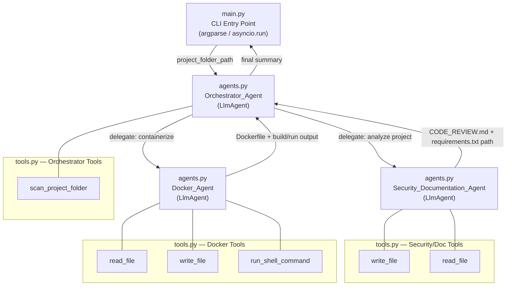

# Design Document

## Multi-Agent Code Review System

---

## Overview

The multi-agent code review system is a Python application split across three files that accepts a project folder path, recursively scans source files, and coordinates two specialized sub-agents to perform security analysis, documentation generation, dependency extraction, and Docker containerization.

The system is built on **Google ADK (Agent Development Kit)** using `LlmAgent` instances backed by Gemini models. The orchestrator delegates work to sub-agents in a strict sequential order, collects their outputs, and presents a final summary to the user.

**Key design decisions:**

- **Multi-file architecture**: The project is split into `tools.py` (all tool functions), `agents.py` (all agent definitions), and `main.py` (CLI entry point) for clarity, maintainability, and ease of debugging.
- **ADK sub-agent pattern**: The `Orchestrator_Agent` holds `Security_Documentation_Agent` and `Docker_Agent` as `sub_agents`, enabling LLM-driven delegation via ADK's built-in transfer mechanism.
- **Tool isolation**: Each agent only receives the tools it needs; no shared mutable global state exists between agents.
- **Iterative Docker repair**: The `Docker_Agent` uses a loop-based retry strategy (max 5 cycles) to resolve build/run failures autonomously.

---

## Architecture

### File Structure

```
multi-agent-code-review/
├── tools.py      # All tool functions (scan_project_folder, read_file, write_file, run_shell_command)
├── agents.py     # All agent definitions (Orchestrator_Agent, Security_Documentation_Agent, Docker_Agent)
└── main.py       # CLI entry point — parses args, imports agents, runs ADK Runner
```

- **`tools.py`** — pure Python functions with no ADK imports; easy to test and modify in isolation.
- **`agents.py`** — imports tools from `tools.py`, constructs all three `LlmAgent` instances.
- **`main.py`** — imports the orchestrator from `agents.py`, wires up `argparse` and `asyncio.run`.

### Agent and Data Flow



**Execution flow:**

1. `main.py` parses `project_folder_path` and starts an ADK `Runner` with `Orchestrator_Agent` (imported from `agents.py`).
2. Orchestrator calls `scan_project_folder` (from `tools.py`) to collect file contents.
3. Orchestrator delegates to `Security_Documentation_Agent` (via ADK sub-agent transfer).
4. `Security_Documentation_Agent` analyzes files, writes `CODE_REVIEW.md` and `requirements.txt`, then returns.
5. Orchestrator delegates to `Docker_Agent` with the `requirements.txt` path.
6. `Docker_Agent` creates `Dockerfile`, builds, runs, and iteratively fixes errors (up to 5 retries).
7. Orchestrator presents a final summary including all artifact paths.

---

## Components and Interfaces

### tools.py

Contains all four tool functions as plain Python functions with no ADK imports. This makes them independently testable and easy to locate when debugging.

```python
# tools.py
def scan_project_folder(folder_path: str) -> dict: ...
def read_file(file_path: str) -> str: ...
def write_file(file_path: str, content: str) -> str: ...
def run_shell_command(command: str, cwd: str) -> dict: ...
```

---

### agents.py

Imports all tools from `tools.py` and constructs the three `LlmAgent` instances. The orchestrator references the other two agents as `sub_agents`.

```python
# agents.py
from tools import scan_project_folder, read_file, write_file, run_shell_command
```

#### Orchestrator_Agent

```python
orchestrator = LlmAgent(
    name="Orchestrator_Agent",
    model="gemini-2.0-flash",
    description="Coordinates the code review pipeline and answers user questions.",
    instruction="""...""",
    tools=[scan_project_folder],
    sub_agents=[security_documentation_agent, docker_agent],
)
```

**Responsibilities:**
- Accept the project folder path from the user.
- Call `scan_project_folder` to collect file contents.
- Validate the path (non-existent or non-directory → error + halt).
- Delegate to `Security_Documentation_Agent` first, then `Docker_Agent`.
- Answer user questions using collected file content and agent outputs.
- Present a final summary with all artifact paths.

**Tools registered:** `scan_project_folder`

---

#### Security_Documentation_Agent

```python
security_documentation_agent = LlmAgent(
    name="Security_Documentation_Agent",
    model="gemini-2.0-flash",
    description="Analyzes code for vulnerabilities, generates documentation, and extracts dependencies.",
    instruction="""...""",
    tools=[read_file, write_file],
)
```

**Responsibilities:**
- Produce a plain-language project summary (grouped by subdirectory if >20 files).
- Detect vulnerability categories: hardcoded secrets, SQL injection, `eval`/`exec` on untrusted input, insecure deserialization, deprecated/vulnerable libraries, missing input validation.
- Write `CODE_REVIEW.md` with sections: Project Summary, File Structure, Security Findings, Dependency List.
- Extract third-party Python imports and write/merge `requirements.txt`.
- Return the `requirements.txt` path to the orchestrator.

**Tools registered:** `read_file`, `write_file`

---

#### Docker_Agent

```python
docker_agent = LlmAgent(
    name="Docker_Agent",
    model="gemini-2.0-flash",
    description="Creates a Dockerfile, builds and runs the Docker image, and iteratively fixes errors.",
    instruction="""...""",
    tools=[read_file, write_file, run_shell_command],
)
```

**Responsibilities:**
- Read `requirements.txt` from the project folder.
- Determine the entry point (`main.py` → `app.py` → first `.py` at root).
- Write a `Dockerfile` using a Python base image.
- Execute `docker build` and `docker run`, capturing stdout/stderr.
- On failure, analyze error output, modify `Dockerfile`/`requirements.txt`, and retry (max 5 cycles).
- Report final build/run output (or failure state) to the orchestrator.

**Tools registered:** `read_file`, `write_file`, `run_shell_command`

---

### main.py

The CLI entry point. Imports `Orchestrator_Agent` from `agents.py`, parses the project folder path via `argparse`, and runs the ADK `Runner` with `asyncio.run`.

```python
# main.py
from agents import orchestrator_agent
import argparse, asyncio
# ... argparse setup and asyncio.run(runner.run(...))
```

---

### Tool Definitions

| Tool | Owner Agent(s) | Signature | Description |
|---|---|---|---|
| `scan_project_folder` | Orchestrator | `(folder_path: str) -> dict` | Recursively scans folder, returns `{relative_path: content}` for recognized source files, skipping binaries, hidden dirs, and non-source dirs |
| `read_file` | Security/Doc, Docker | `(file_path: str) -> str` | Reads and returns text content of a file |
| `write_file` | Security/Doc, Docker | `(file_path: str, content: str) -> str` | Writes text content to a file, creating or overwriting it |
| `run_shell_command` | Docker | `(command: str, cwd: str) -> dict` | Executes a shell command, returns `{stdout, stderr, exit_code}` |

---

## Data Models

### ScannedProject

Returned by `scan_project_folder`. Passed to sub-agents via session state or orchestrator prompt context.

```python
# Conceptual structure (passed as dict in tool return value)
{
    "project_folder": str,          # absolute path to the project root
    "files": {
        "relative/path/to/file.py": "file content as string",
        ...
    },
    "file_count": int,
    "error": str | None             # set if path invalid
}
```

### VulnerabilityFinding

Produced by `Security_Documentation_Agent` during analysis. Serialized into `CODE_REVIEW.md`.

```python
{
    "file_path": str,               # relative path within project
    "line_number": int,             # 1-indexed line number
    "category": str,                # e.g. "hardcoded_secret", "sql_injection"
    "description": str              # plain-language risk description
}
```

### ShellResult

Returned by `run_shell_command`.

```python
{
    "stdout": str,
    "stderr": str,
    "exit_code": int
}
```

### DockerBuildState

Maintained internally by `Docker_Agent` across retry cycles.

```python
{
    "attempt": int,                 # current attempt number (1–5)
    "dockerfile_content": str,      # last written Dockerfile content
    "requirements_content": str,    # last written requirements.txt content
    "last_error": str,              # last build or run error output
    "success": bool
}
```

---

## Correctness Properties

*A property is a characteristic or behavior that should hold true across all valid executions of a system — essentially, a formal statement about what the system should do. Properties serve as the bridge between human-readable specifications and machine-verifiable correctness guarantees.*

### Property 1: File scan completeness and filtering

*For any* valid project folder containing files with a mix of recognized and unrecognized extensions, and directories including skip-list directories (e.g., `node_modules`, `.git`, `__pycache__`), the `scan_project_folder` tool SHALL include every file with a recognized source extension that is not inside a skipped directory, and SHALL exclude every file from a skipped directory, every file with an unrecognized extension, and every binary file.

**Validates: Requirements 1.2, 1.4, 1.5**

---

### Property 2: Invalid path produces error and no artifacts

*For any* path string that does not correspond to an existing directory, the system SHALL return a descriptive error message and SHALL NOT create `CODE_REVIEW.md`, `requirements.txt`, or `Dockerfile` at any file system location.

**Validates: Requirements 1.3, 2.3**

---

### Property 3: Vulnerability record completeness

*For any* source file containing an injected instance of a detectable vulnerability pattern (hardcoded secret, SQL injection, `eval`/`exec` on untrusted input, insecure deserialization, deprecated library, missing input validation), the generated `CODE_REVIEW.md` SHALL contain a finding entry for that pattern that includes all four required fields: file path, line number, vulnerability category, and plain-language description.

**Validates: Requirements 4.1, 4.2**

---

### Property 4: requirements.txt deduplication and merge

*For any* combination of an existing `requirements.txt` with a set of package names and a newly detected set of package names (with deliberate overlaps), the resulting `requirements.txt` SHALL contain exactly the union of both sets with no duplicate package names and no entries dropped.

**Validates: Requirements 6.3**

---

### Property 5: Docker retry bound and failure report

*For any* sequence of `docker build` or `docker run` commands that always exit with a non-zero status code, the `Docker_Agent` SHALL attempt exactly 5 fix-and-retry cycles, then stop and report a failure that includes the final error output and the last state of the `Dockerfile`.

**Validates: Requirements 9.3, 9.4**

---

### Property 6: CODE_REVIEW.md section ordering

*For any* project analysis, the generated `CODE_REVIEW.md` SHALL contain the four sections — Project Summary, File Structure, Security Findings, and Dependency List — and they SHALL appear in that exact order.

**Validates: Requirements 5.2, 3.2**

---

### Property 7: Dockerfile required elements

*For any* `requirements.txt` content and project folder, the generated `Dockerfile` SHALL contain a `FROM python` base image instruction, a `COPY` instruction for project files, a `RUN pip install -r requirements.txt` instruction, and a `CMD` or `ENTRYPOINT` instruction specifying the resolved entry point.

**Validates: Requirements 7.2**

---

### Property 8: Entry point selection priority

*For any* project folder root, the `Docker_Agent` SHALL select `main.py` as the entry point if it exists; otherwise `app.py` if it exists; otherwise the first `.py` file found at the root level — and SHALL NOT select a file from a subdirectory when a root-level `.py` file is available.

**Validates: Requirements 7.3**

---

### Property 9: Security agent error halts pipeline

*For any* error message returned by the `Security_Documentation_Agent`, the `Orchestrator_Agent` SHALL report that error to the user and SHALL NOT invoke the `Docker_Agent`.

**Validates: Requirements 2.3**

---

## Error Handling

| Scenario | Handling |
|---|---|
| Project path does not exist | `scan_project_folder` returns `{"error": "..."}`. Orchestrator reports error to user and halts — does not invoke sub-agents. |
| Project path is a file, not a directory | Same as above. |
| File read error during scan (permissions, encoding) | File is skipped; a warning is included in the scan result. |
| `Security_Documentation_Agent` fails | Orchestrator reports the error to the user and does NOT invoke `Docker_Agent` (Requirement 2.3). |
| `docker build` fails | `Docker_Agent` analyzes stderr, modifies `Dockerfile`/`requirements.txt`, retries. After 5 failures, reports final error + last `Dockerfile` state to orchestrator. |
| `docker run` fails | Same retry logic as build failure. Agent may update `requirements.txt` and rebuild before retrying run. |
| Max Docker retries reached | `Docker_Agent` returns failure report with last error output and `Dockerfile` content. Orchestrator includes this in the final summary. |
| Binary file encountered during scan | File is silently skipped (detected via `bytes` decode failure or known binary extensions). |

---

## Testing Strategy

### Unit Tests

Unit tests cover discrete, pure-logic functions that do not require a running LLM or Docker daemon:

- `scan_project_folder`: verify correct file inclusion/exclusion for various directory structures, extension lists, and skip-list directories.
- `write_file` / `read_file`: verify round-trip correctness (write then read returns identical content).
- Dependency extraction logic: verify that import statements are correctly mapped to pip package names and that deduplication works.
- Vulnerability pattern matching: verify that known-bad code snippets are flagged and known-safe snippets are not.
- `run_shell_command`: verify that exit codes, stdout, and stderr are correctly captured.

### Property-Based Tests

Property-based tests use **Hypothesis** (Python) with a minimum of 100 iterations per property.

Each test is tagged with a comment in the format:
`# Feature: multi-agent-code-review, Property N: <property_text>`

| Property | Test Strategy |
|---|---|
| **P1: File scan completeness and filtering** | Generate random directory trees with random file names, extensions, and skip-list directories. Assert all recognized-extension files outside skip dirs appear in output; assert no skipped files appear. |
| **P2: Invalid path → no artifacts** | Generate random non-existent path strings. Assert error is returned and no files are written. |
| **P3: Vulnerability record completeness** | Generate synthetic source files with injected vulnerability patterns. Assert each injected pattern produces a finding with all four required fields (path, line, category, description). |
| **P4: requirements.txt deduplication** | Generate random sets of existing and new package names with deliberate overlaps. Assert merged output contains the exact union with no duplicates. |
| **P5: Docker retry bound and failure report** | Mock `run_shell_command` to always return non-zero exit codes. Assert exactly 5 retry attempts are made, then a failure report containing error output and Dockerfile content is returned. |
| **P6: CODE_REVIEW.md section ordering** | Generate random project file sets. Assert the four required sections appear in the correct order in the output markdown. |
| **P7: Dockerfile required elements** | Generate random `requirements.txt` content. Assert generated Dockerfile contains FROM python, COPY, RUN pip install, and CMD/ENTRYPOINT. |
| **P8: Entry point selection priority** | Generate project root structures with various combinations of `main.py`, `app.py`, and other `.py` files. Assert correct priority-based selection. |
| **P9: Security agent error halts pipeline** | Generate random error messages from a mocked `Security_Documentation_Agent`. Assert `Docker_Agent` is never invoked and the error is reported. |

### Integration Tests

Integration tests verify end-to-end behavior against a real (or mocked) environment:

- Full pipeline run against a small synthetic Python project: assert `CODE_REVIEW.md`, `requirements.txt`, and `Dockerfile` are created with correct content.
- Orchestrator halts correctly when `Security_Documentation_Agent` returns an error (mock the sub-agent).
- Docker retry loop terminates and reports failure after 5 mocked failures.

> Note: Tests that invoke `docker build` / `docker run` against a real Docker daemon are integration tests and should be run in a CI environment with Docker available. They are not property-based tests due to cost and environment requirements.
